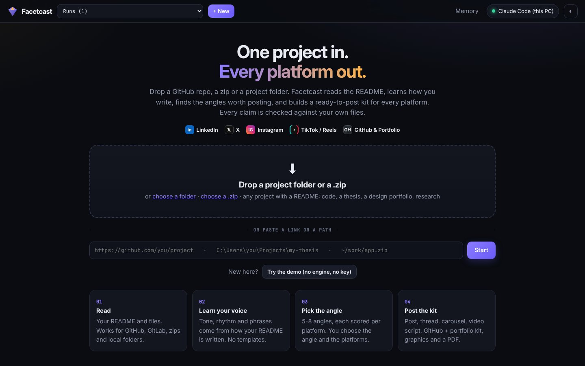
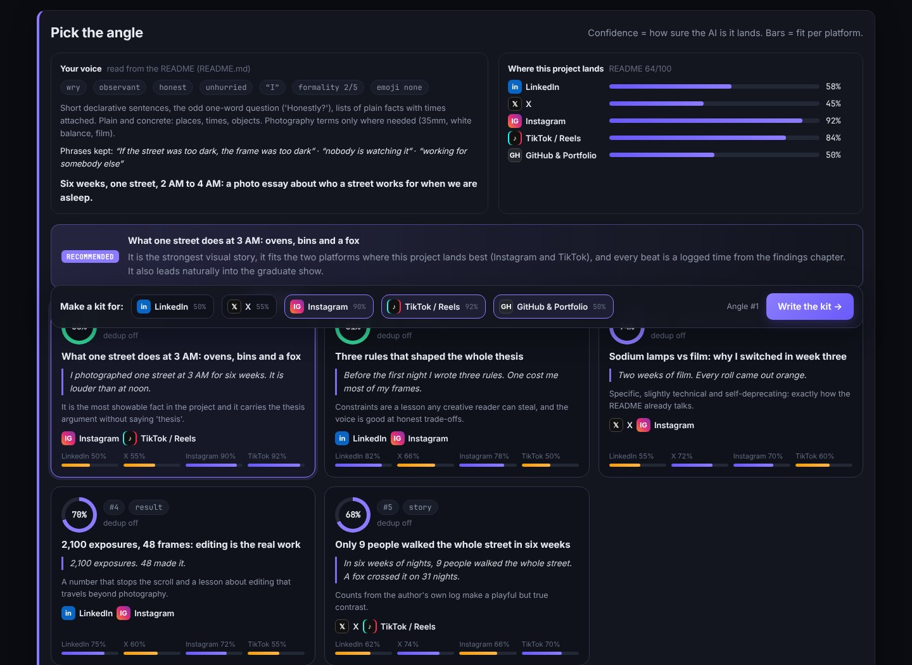
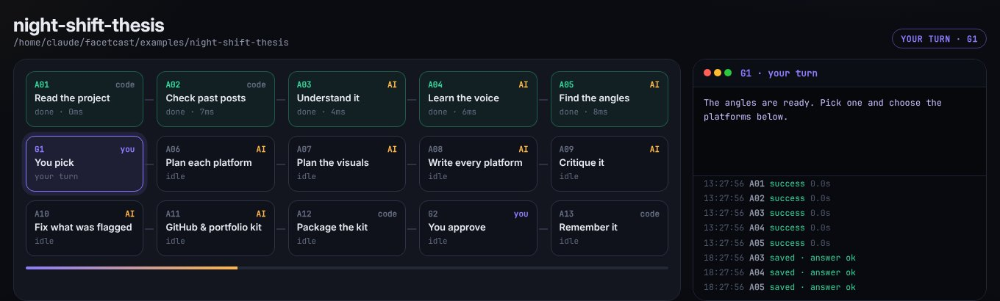
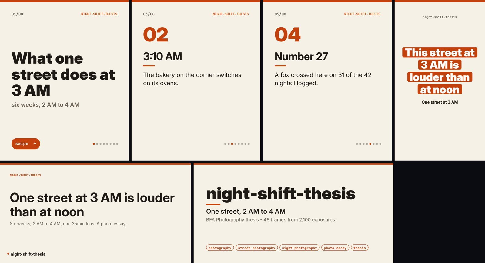
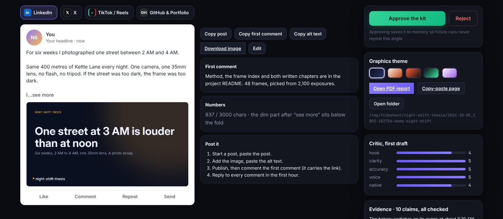
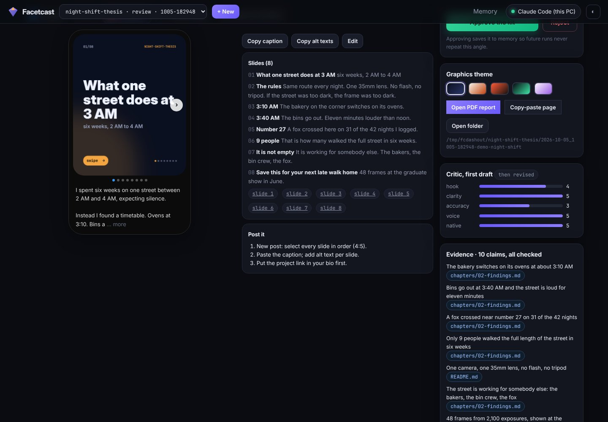
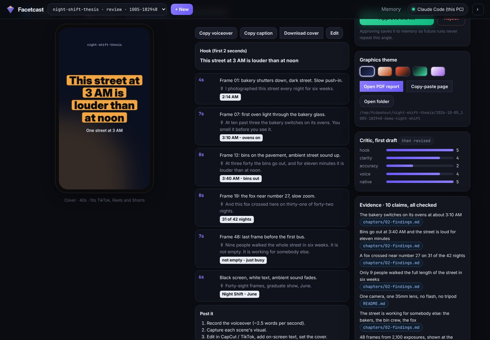
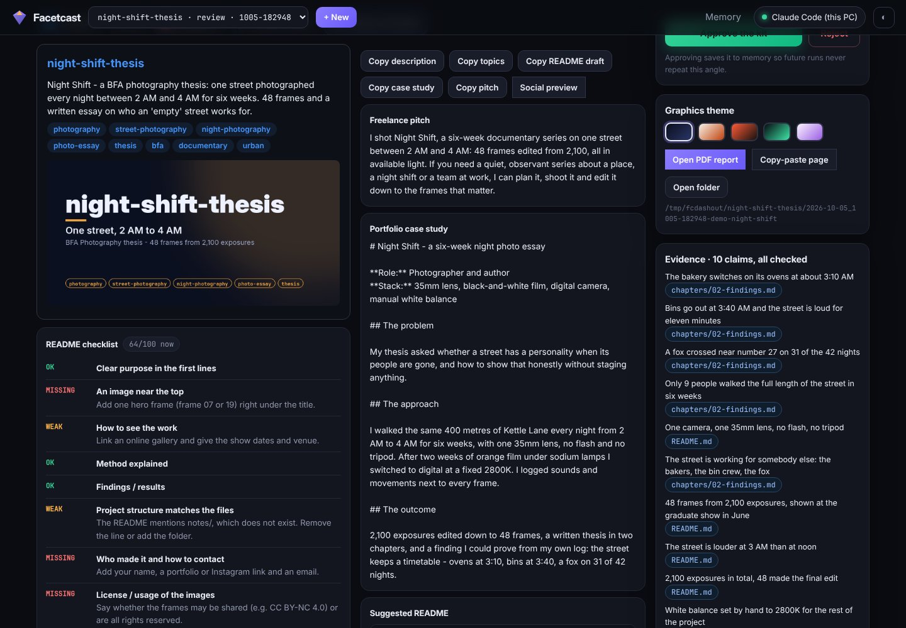
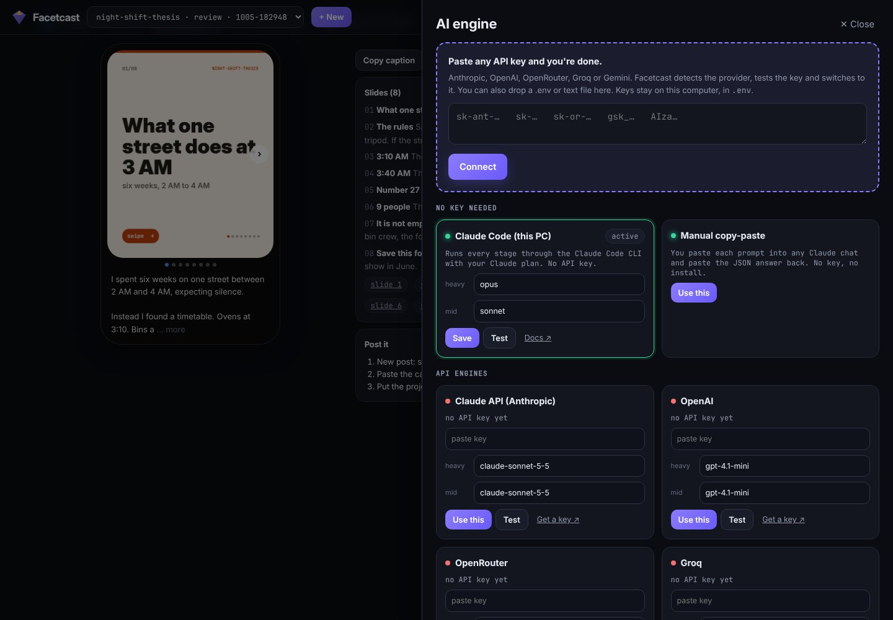

<div align="center">


# Facetcast

### One project in. Every platform out.

Point Facetcast at a GitHub repo, a zip or a folder. It reads your README, learns how **you** write,
finds the angles worth posting, and builds a ready-to-publish kit for **LinkedIn, X, Instagram,
TikTok / Reels / Shorts and your GitHub portfolio**. Every factual claim is checked against your own files.

[](https://github.com/Shaheer-Cybersec/facetcast/actions/workflows/ci.yml)


[Quick start](#quick-start) ·
[See it work](#see-it-work) ·
[How it works](#how-it-works) ·
[What you get](#what-you-get) ·
[AI engines](#ai-engines) ·
[Troubleshooting](#troubleshooting) ·
[Docs](docs/)



</div>

---

## The problem

You finished something: an app, a security tool, a thesis, a photo series, a research project.
Now you have to explain it again on every platform, in a voice that sounds like you, without
overselling it. Most tools hand you one generic post in one generic voice, and sometimes invent
features that don't exist.

Facetcast treats your project as the source of truth:

| | Typical AI post tools | Facetcast |
|---|---|---|
| **Voice** | One preset tone | Learned from your README (and your past posts, if you add them) |
| **Facts** | Whatever the model says | Every claim carries a file and commit; invented ones are rejected **by code** |
| **Projects** | Code only, or text you paste | Repos, zips, folders; code, theses, design, research, writing |
| **Platforms** | One post | Per-platform angle scoring, then a full kit for each platform you choose |
| **Visuals** | None | Rendered cards, carousel slides, covers, social preview |
| **Cost / privacy** | Cloud account, API key | Runs on your machine; Claude Code or copy-paste needs no key |

## Quick start

**You need:** Python 3.10+ (on Windows, tick "Add python.exe to PATH" in the installer). `git` is
only needed for git URLs.

```bash
git clone https://github.com/Shaheer-Cybersec/facetcast.git
cd facetcast
```

| OS | Start it |
|---|---|
| Windows | double-click **`start.bat`** |
| macOS / Linux | `./start.sh` |

The first run creates a virtual environment, installs four small packages and opens the dashboard at
<http://127.0.0.1:8765>. Press **Try the demo** to see a complete kit with no engine and no key.

<details>
<summary>Manual setup, any OS</summary>

```bash
python -m venv .venv
# Windows: .venv\Scripts\activate        macOS/Linux: source .venv/bin/activate
pip install -r requirements.txt
python facetcast.py doctor      # checks Python, packages, git, engine, fonts
python facetcast.py serve       # opens the dashboard
```
</details>

### Set up Claude Code from the command line (optional, no API key)

Facetcast's default engine is the local `claude` command, which uses your Claude plan (Pro, Max, Team or Enterprise).

| Step | Windows PowerShell | Windows CMD | macOS / Linux |
|---|---|---|---|
| 1. Install | `irm https://claude.ai/install.ps1 \| iex` | `curl -fsSL https://claude.ai/install.cmd -o install.cmd && install.cmd && del install.cmd` | `curl -fsSL https://claude.ai/install.sh \| bash` |
| 2. Check (new terminal) | `claude --version` | `claude --version` | `claude --version` |
| 3. Log in | run `claude`, sign in, or type `/login` inside it | same | same |
| 4. Test | `claude -p "say ok"` | same | same |

`/login` is typed **inside** `claude`, not in the shell. Full guide with fixes for every error:
[docs/CLAUDE_CODE_SETUP.md](docs/CLAUDE_CODE_SETUP.md). No Claude plan? Use manual copy-paste or paste an API key in the dashboard.

## See it work

1. **New run**: paste a repo URL, drop a zip or drop a folder.
2. Facetcast reads the project, learns the voice, and proposes 5-8 angles, each scored per platform.
3. **Gate 1, you pick** the angle and the platforms.
4. It plans, writes, critiques and fixes every platform's content, then runs the evidence check.
5. **Gate 2, you review**: edit any text, switch the theme, approve.
6. Open the kit folder and post. Nothing is published for you.



No engine yet? `python facetcast.py demo` runs the whole thing on a bundled example project
(a fictional photography thesis) using pre-written answers. See a real finished report:
[docs/assets/sample-report.pdf](docs/assets/sample-report.pdf).

## How it works



Thirteen agents and two human gates. Code does everything that can be checked; models do only what
needs judgement, and code checks their output.

| # | Agent | Runs on | What it does |
|---|---|---|---|
| A01 | **Ingest** | code | Reads a GitHub / GitLab / Bitbucket URL, a zip or a local folder. README first, then docs and entry points. Zip-slip and zip-bomb safe. |
| A02 | **Recall** | code | Loads everything you published before, so nothing repeats. |
| A03 | **Analyzer** | AI | What the project is, its key parts, decisions, highlights and limits. Findings without evidence are dropped. |
| A04 | **Profiler** | AI | Reads your voice, audiences, README quality, platform fit and a visual theme. Signature phrases are verified word for word. |
| A05 | **Angles** | AI | 5-8 distinct angles scored per platform, deduped against your history. |
| G1 | **You pick** | you | Choose the angle and the platforms. |
| A06 | **Strategist** | AI | One core message, shaped per platform: format, hook, beats, length, CTA. |
| A07 | **Visuals** | AI | Cover headline, what to capture, reusable images from the project. |
| A08 | **Writer** | AI | Writes every platform in your voice, with limits enforced. |
| A09 | **Critic** | code + AI | Style checks in code, then an editorial review. Quotes it can't find are discarded. |
| A10 | **Reviser** | AI | Fixes only what was flagged. A surviving "block" flag fails the run. |
| A11 | **Showcase** | AI | GitHub & portfolio kit: README audit, improved README, topics, case study, freelance pitch. |
| A12 | **Packager** | code | Final evidence check and hard limits, then renders images, PDF and the kit folder. |
| G2 | **You approve** | you | Review, edit, switch themes, approve or reject. |
| A13 | **Archive** | code | Remembers what you approved so future runs stay fresh. |

Runs are resumable: every step is checkpointed, so a run can stop anywhere (waiting for you, a
network error) and continue exactly where it was. Details in [docs/ARCHITECTURE.md](docs/ARCHITECTURE.md).

### Why the facts can be trusted

Every factual sentence is stored as `{claim, source_path, source_ref}`. Code then checks that the file
exists and that the commit SHA (or content hash) is real. If a claim cannot be verified, the stage
fails closed instead of shipping it. A model can still write a weak sentence; it cannot invent a file.

## What you get



```
outputs/<project>/<date>_<run>/
├── 00_REPORT.pdf          previews, kits, evidence, how it was made
├── 00_START_HERE.md       posting steps per platform
├── index.html             offline page with Copy buttons
├── linkedin/   post.md · first_comment.md · alt_text.md · graphic.png (1200×627)
├── x/          thread.md · alt_text.md · card.png (1600×900)
├── instagram/  caption.md · slides.md · alt_text.md · slide-01..NN.png (1080×1350)
├── tiktok/     script.md · caption.md · cover.png (1080×1920)
├── github/     README.suggested.md · repo-settings.md · checklist.md · case-study.md · pitch.md · social-preview.png
└── visuals.md · evidence.md · voice-profile.md · run-summary.md · manifest.json
```

| Platform | Content | Limits enforced |
|---|---|---|
| **LinkedIn** | Post, first comment (link goes there), alt text, 1200×627 card | 3,000 chars, hook inside the fold |
| **X** | Thread of up to 10 tweets, 1600×900 card | 280 per tweet, URLs count 23 |
| **Instagram** | Carousel of 3-10 rendered slides, caption, alt text | 2,200-char caption, short slides |
| **TikTok / Reels / Shorts** | Faceless-friendly script with scenes, voiceover timing, on-screen text, cover | 15-90 s, ~2.6 words/s |
| **GitHub & portfolio** | README audit and draft, description, topics, social preview, case study, freelance pitch | Description trimmed to 350 |

Five graphic themes: `midnight`, `paper`, `bold`, `terminal`, `pastel`. The profiler picks one with an
accent colour that suits the project; switch with one click and every graphic is redrawn. Contrast is
corrected automatically and the fonts (Inter, JetBrains Mono) are bundled so output looks the same on every OS.

<table>
<tr>
<td></td>
<td></td>
</tr>
<tr>
<td></td>
<td></td>
</tr>
</table>

## AI engines

You choose what answers the model steps. No key is required to get started.

| Engine | Key? | How |
|---|---|---|
| **Claude Code** | no | Uses your Claude plan through the local `claude` CLI. Fully automatic. |
| **Manual copy-paste** | no | Facetcast shows each prompt; paste it into any chat, paste the JSON reply back. |
| Anthropic, OpenAI, OpenRouter, Groq, Gemini | yes | **Engines** in the dashboard: paste the key or drop a `.env` file. The provider is detected and the key tested. |
| Ollama, LM Studio | no | Local models through their OpenAI-compatible endpoint. |
| Custom | optional | Any OpenAI-compatible URL (Together, Mistral, DeepSeek, vLLM...). |



Keys are written only to your local `.env` (gitignored) and shown masked. CLI: `python facetcast.py engine key <key>`.
More in [docs/ENGINES.md](docs/ENGINES.md).

## CLI

```bash
python facetcast.py serve                                  # dashboard
python facetcast.py demo                                   # full example run, no engine
python facetcast.py start https://github.com/you/project   # or a .zip, or a folder path
python facetcast.py start ./my-thesis --platforms instagram,tiktok,github
python facetcast.py pick <run> 2 --platforms linkedin,x    # Gate 1
python facetcast.py theme <run> paper                      # redraw every graphic
python facetcast.py approve <run>                          # Gate 2
python facetcast.py list | status <run> | resume <run> | reject <run> "reason"
python facetcast.py engine [use|key|test] ...
python facetcast.py doctor
```

## Make it sound even more like you

- Put a few of your own posts in `memory/voice/my_posts.md` (format in [memory/voice/README.md](memory/voice/README.md)).
  The profiler weighs them above the README. They stay local and are gitignored.
- Set `FACETCAST_AUTHOR_NAME`, `FACETCAST_AUTHOR_HANDLE` and `FACETCAST_AUTHOR_HEADLINE` in `.env` to put your
  name on graphics and previews.
- `pip install -r requirements-embeddings.txt` turns on semantic dedup. Without it, angles are marked
  "unchecked"; nothing is faked.

## Security and privacy

| Risk | Defence |
|---|---|
| Another website driving your dashboard | Every write needs a custom header and same-origin check (CSRF) |
| DNS rebinding | Foreign `Host` headers are refused |
| Network exposure | Binds to `127.0.0.1` only |
| Script injection | Model and project text is escaped; strict CSP |
| Malicious zips | Zip-slip, symlink, file-count and size limits |
| Key leaks | Keys live in `.env` only, are masked in the UI and API |
| Model acting on your machine | Claude Code runs every stage with tools disabled in an empty temp folder |

Your projects, runs and memory stay in `data/` and `outputs/` on your machine (both gitignored).
Facetcast sends project text to whichever engine you choose, so use a local engine for private code.
Full table and reporting: [SECURITY.md](SECURITY.md).

## Troubleshooting

| Symptom | Fix |
|---|---|
| `Failed to authenticate: OAuth session expired` | Your Claude Code login expired. In a terminal run `claude`, type `/login`, finish the browser sign-in, then **Retry this step**. `/login` is typed *inside* `claude`, not in the shell. Or switch engine. See [docs/CLAUDE_CODE_SETUP.md](docs/CLAUDE_CODE_SETUP.md). |
| `claude is not recognized` | Claude Code is not installed or the terminal is old. Install it (table above), then open a **new** terminal. |
| `start.bat` says Python is missing | Install Python 3.10+ and tick **Add python.exe to PATH**, then run it again. |
| Port 8765 already in use | `python facetcast.py serve --port 8800` or set `FACETCAST_PORT` in `.env`. |
| A step failed halfway | Click **Retry this step**, or `python facetcast.py resume <run>`. Finished steps are not redone. |
| Manual engine waiting | Paste the shown prompt into a Claude chat and save the JSON reply where the dashboard says, then resume. |
| Anything else | `python facetcast.py doctor` prints what is wrong. |

## FAQ

**Does it post for me?** No. It builds the kit; you review and post. That is deliberate.

**Does it work without a README?** Yes, with less to learn the voice from. It reads docs and entry
points, and the Profiler tells you how good the README is and what is missing.

**Can I use it on a private repo?** Point it at a local folder or zip. Use a local engine if the code must not leave your machine.

**Is the output "AI sounding"?** The critic flags known AI tells and checks emoji and tone against your voice
profile, but you are the final editor. Edit at Gate 2.

## Project layout

```
facetcast.py     CLI entry point
agents/          the 13 agents (agent.py, plus prompt.md for AI agents)
core/            orchestrator, engines, evidence checks, platforms, graphics, report/PDF
dashboard/       local web UI (standard-library server, vanilla JS, no build step)
memory/          SQLite memory, embeddings, voice samples
examples/        non-code example project and pre-written demo answers
scripts/         prepush_check.py (scan what git would publish) and a git pre-push hook
tests/           pipeline, agents, engines (fake providers), dashboard API, security
docs/            architecture, engines, platforms, Claude Code setup, GitHub setup
```

| Doc | What it covers |
|---|---|
| [docs/CLAUDE_CODE_SETUP.md](docs/CLAUDE_CODE_SETUP.md) | Install and log in to Claude Code from CMD / PowerShell |
| [docs/ENGINES.md](docs/ENGINES.md) | Every engine, keys, local models |
| [docs/PLATFORMS.md](docs/PLATFORMS.md) | Per-platform output and limits; adding a platform |
| [docs/ARCHITECTURE.md](docs/ARCHITECTURE.md) | The state machine, agents, evidence model |
| [docs/GITHUB_SETUP.md](docs/GITHUB_SETUP.md) | Publish this repo safely |

## Contributing

Good first contributions: a new platform ([docs/PLATFORMS.md](docs/PLATFORMS.md)), a graphics theme,
better prompts, dashboard translations. Read [CONTRIBUTING.md](CONTRIBUTING.md); `pytest` and `ruff check .` must pass.

```bash
pip install -r requirements-dev.txt
pytest && ruff check .
git config core.hooksPath scripts/hooks     # run the secret / private-file check before every push
```

Please follow the [code of conduct](CODE_OF_CONDUCT.md). Security issues go through
[private reporting](SECURITY.md), not public issues.

## License

[MIT](LICENSE) © Shaheer (ShaheerSec). Bundled fonts Inter and JetBrains Mono are under the SIL Open Font
License (see `assets/fonts/`).
